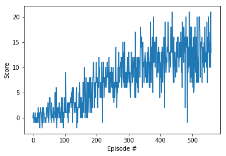

# Report: Project 1 - Navigation 
## Introduction 

In this report we present a DeepRL agent solving a variation of [Unity Banana Collector](https://github.com/Unity-Technologies/ml-agents/blob/master/docs/Learning-Environment-Examples.md#banana-collector) task.
All the available code is contained in this directory. Just run follow the instructions in [README.md](https://github.com/vblagoje/deep-reinforcement-learning/blob/master/p1_navigation/README.md) 

## Solution

The solution involves adapting a vanilla Deep Q-Learning Network we've studied in [Lunar lander](https://github.com/udacity/deep-reinforcement-learning/tree/master/dqn/solution) task. 
The adaptation involves adjusting the main agent training code that used Open AI gym environment to Unity ML-agent toolkit environment. 

The neural network is essentially a sequential neural network consisting of four layers of neurons: an input layer, two hidden layers, and an output layer. 
We used rectified linear unit layer between the input layer and the first hidden layer as well as between first and second hidden layer. 
While the sizes of two hidden layers are mostly arbitrary (we used 128 and 64), the size of the input and output layers are fixed. The size of 
the input layer is equal to environment state size while the final output layer has an output size equal to environment's (agent's) action size. 
In the case of banana hunting agent the state size (first input layer size) is 37 and output size (action size) is 4. The state size 
is 37-dimensional because it contains ray-based perception of objects in agent's forward direction along with agent's velocity. 
Action size is 4 because an agent has an option to walk forward, backward, turn left and right.

THE DQN learning algorithm used to solve the task of collecting yellow bananas has a particular structure that is important to understand. First, 
DQN algorithm represents the optimal action-value function as deep neural network (DNN) instead of a table. In fact, DQN has two identical deep neural 
networks: primary and target. We use two networks because in temporal difference error calculation target function changes frequently with DNN leading to 
unstable learning. During training, we fix parameters of the target network and replace it with the primary network's every x-many steps. If we did not 
fix the Q-targets by using the target network we would encounter a harmful form of correlation where we shift the parameters of the network based on a 
constantly moving target.

Unfortunately, that is not the only issue we face in Q-learning using neural networks. When an agent interacts with the environment, the sequence of 
experiences can be highly correlated. The naive Q-learning algorithm that learns from each of these experience tuples in sequential order runs 
the risk of getting influenced by the effects of this correlation. To tackle this issue DQN algorithm uses a technique called experience replay. We 
essentially keep a buffer of sequential experience with environment but we sample those experiences from the buffer at random thus avoiding 
correlation and subsequent diverging of action values.

The DQN algorithm was able to solve the modified banana task in around 400-500 episodes consistently (460 episodes in the example run of the Navigation.ipynb).
Here is the algorithms rewards(score) plot captured during the training episodes: 

 

There were no changes to the hyper-parameters from the DQN Lunar lander lesson. The decay factor (gamma) was 0.99, the network was trained using 
batch size of 64 samples, the learning rate was unchanged at 0.0005. Target network was updated every four steps. Epsilon starting value was 1, 
the epsilon decay was 0.995, while the minimum possible epsilon value was set to 0.01.  

One can visualize the trained agent's hunt for bananas at https://www.youtube.com/watch?v=1uPnUyaaRNw

## Ideas for future work
+ During the actual use of the trained agent, for some reason the agent gets "confused" if it does not see any yellow bananas in the visual field and it starts to jitter. It would be great to introduce some sort of random search that is less jittery. Not sure how to do this actually, but will investigate.
+ Use other variations of DQN agent, ultimately finishing with Rainbow algorithm to see how fast it would solve the task :-) Perhaps the training plot would be smoother than the plain vanilla DQN as well.
