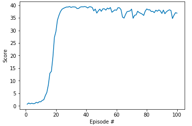

# DRLND Project 2 - Continuous Control - Unity Reacher

## Overview and background

In this agent environment, a double-jointed robotic arm can move to target locations, and the goal of the agent is to maintain its position at the target location for as many time steps as possible. A reward of +0.1 is provided for each step that the agent's hand is in the goal location. The goal for an AI agent in the "Reacher" environment is to keep an arm on a ball for as long as possible. The task is considered solved when the agent receives an average reward of at least 30 over 100 consecutive episodes.

The Unity environment comes in two variants: a single agent or 20 agents where each agent explores and learns in parallel with its copy of the environment.  Initially, I started experiments with the single agent using ddpg-pendulum codebase as a starting point, but agent training was rather slow no matter how I tuned the hyperparameters. After dozens of unsuccessful attempts, I switched to a 20 agent variant which required some minor changes in Actor class, namely in agent stepping, replay buffer sharing, and size dimensions of OUNoise class. 

The provided solution uses Python and PyTorch library. The agent and actor/critic models are in a separate Python files/classes while Jupyter notebook demonstrates agent training, a graphical plot of the successful training, saving of the trained model, and finally launching and observing an agent in Unity environment using a trained model.

## Model overview and hyperparameter selection

DDPG is a model-free, off-policy actor-critic algorithm using deep function approximators that can learn policies in high-dimensional, continuous actions spaces. DDPG is a policy gradient-based algorithm using two separate deep neural networks (one actor and one critic) to explore the complex environments and to learn competitive policies despite those complex high-dimensional and continuous action environments. 

I started with the default hyperparameters from the DDPG paper (section 7), combined and adjusted with the hyperparameters used in the ddpg-pendulum project. As original DDPG paper, I also used Adam for learning the neural network parameters, and I started with a learning rate of 1e-4 and 1e-3 for the actor and critic respectively. The neural network also had 2 hidden layers of 400 and 300 units for all neural networks (both actor and critic). Just as the ddpg-pendulum project I used ReLU activation functions in hidden layers and tanh on the output layers. I also increased the batch size from 64 to 256 as I found the batch size of 64 to underperform compared to 256. I also found that setting a learning rate of 1e-4 for both the actor and the critic sped up learning while remaining stable throughout a dozen hyperparameter tuning sessions I tried. I also found that using L2 weight decay value (1e-2) recommended in section 7 of the DDPG paper inhibited the learning rate somewhat, so I left it at the default value of 0 - which performed better for the given combination of the above-described hyperparameters and their values. 

After agents consistently reached an average score in the range of 35 to 37, I decided to add less of exploration noise. The provided ddpg-pendulum agent always adds exploration noise, so I augmented it to use decaying epsilon value and the decaying factor which significantly reduced exploration noise after about 20-40 episodes. This final adjustment lead to steady scores of about 37-39 per episode with minimal variation until an average the training objective got reached. 

The remaining hyperparameters including discount factor gamma, tau for soft target updates, replay buffer size, and the parameters for the Ornstein-Uhlenbeck process were left to be the same as in the DDPG paper.  

## Results 

The above-described hyperparameters and the accompanying values achieved the required goal of an average 30+ score in 100 consecutive episodes.  More importantly, the training results were achieved in a steady, fast, and stable training in half a dozen attempts I tried. An average score of 30+ was achieved in just 78 episodes and remained steady above 30 for the consecutive 100 episodes. 

## Ideas for Future Work

In the future, I would like to experiment with multiple parallels training runs on distributed platforms like Kubeflow. It takes so much time to do one development cycle for DDPG and Deep Reinforcement Learning in general by doing everything (hyperparameter tuning, finding bugs) on a local computer.
