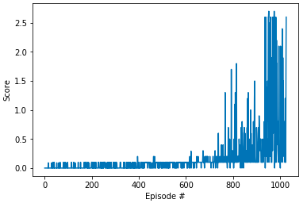

# Report: Project 3 - Collaboration and Competition
## Introduction 

In this project we need to develop a multi-agent solving a variation of [Unity Tennis environment](https://github.com/Unity-Technologies/ml-agents/blob/master/docs/Learning-Environment-Examples.md#tennis).

All agent code is contained in this directory. Follow the instructions in [README.md](https://github.com/vblagoje/deep-reinforcement-learning/blob/master/p3_collab-compet/README.md) 

## Solution

The presented solution involves adaptation of an already implemented DDPG algorithm we had 
in [project 2](https://github.com/vblagoje/deep-reinforcement-learning/blob/master/p2_continuous-control/ddpg_agent.py), 
but adapted for a multi-agent environment. The algorithm variation is aptly named: Multi-Agent Deep Deterministic 
Policy Gradient (MADDPG). As we have seen in project 2, DDPG learning algorithm is well suited for continuous 
tasks; MADDPG just extends DDPG to a multi-agent environment.

MADDPG differs from its original DDPG version in a way that each agent in MADDPG has its own actor and critic 
but share common experience replay buffer which contains tuples with states and actions from all agents. Each 
agent does its sampling from this shared replay buffer allowing agents to learn their reward function but incorporate 
the actions of other agents in their learning.

### Hyperparameters

The following hyperparameters were used:

  - Both actor and critic for each agent have two layer networks: 256 hidden units in the first layer, 128 in the second
  - I have reused actor/critic network models from project 2 (with slight modifications to account for number of agents)
  - Relu activation functions were used for both actor and critic models (hidden layers), tanh for the output layers (actor only)
  - Discount factor gamma of 0.99
  - Soft target update parameter tau of 6e-2
  - Replay buffer size of 1e6
  - Batch size of 128
  - Gradient upgrade was done on every step
  - Learning rate for both actor and critic were 1e-3
  - Epsilon start value of 8, decay factor was set to 0.997

MADDPG algorithm was able to solve the modified Unity Tennis environment in about 1000 episodes consistently. Although 
the score required to solve the environment was set to 0.5 I increased the score to 1.

Here is the algorithms rewards(score) plot captured during the training episodes: 

 

### Future Ideas

Next logical step would be to implement Prioritized Experience Replay and to see how it affects agents learning. 
Another idea would be to experiment with four agents, essentially playing tennis doubles.
